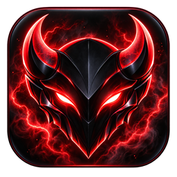
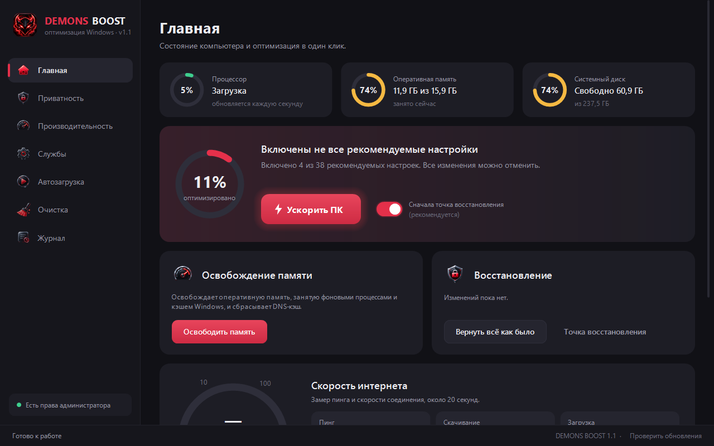
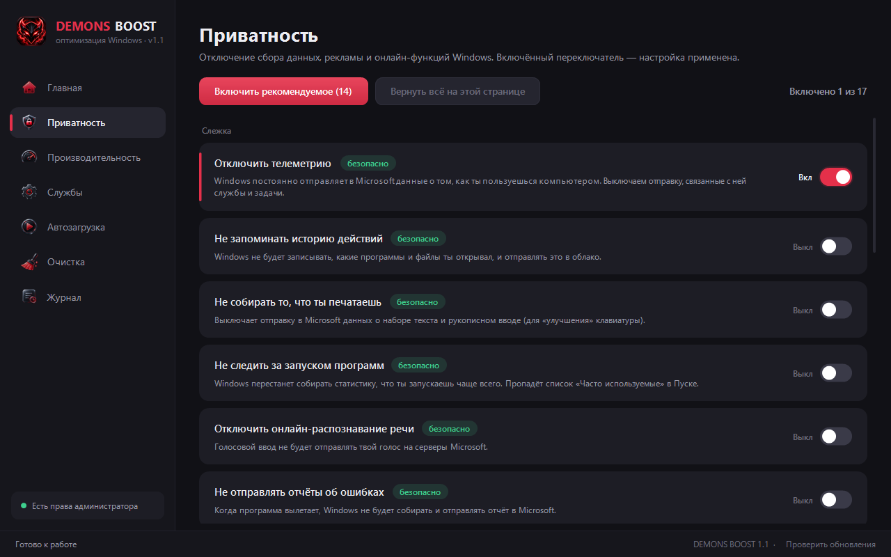
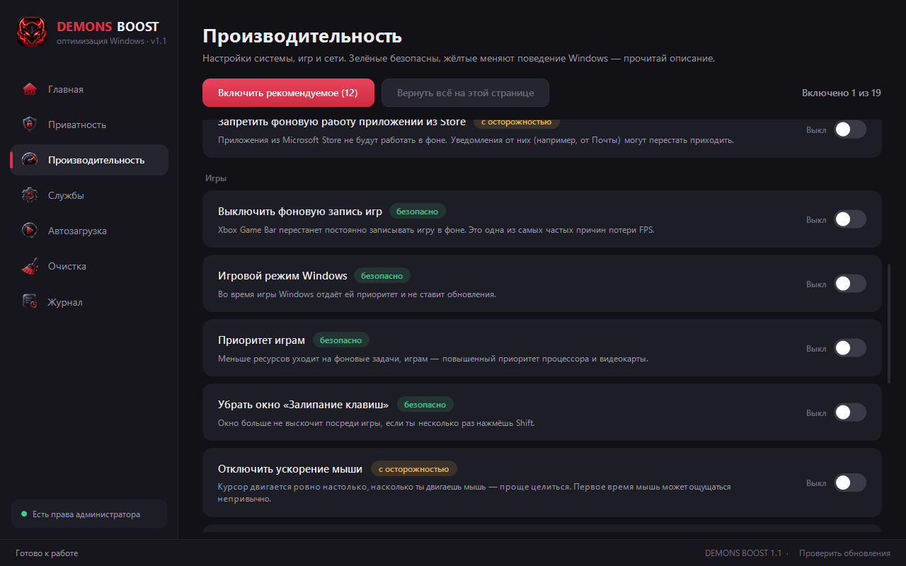
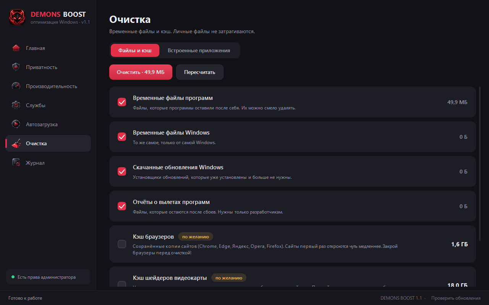
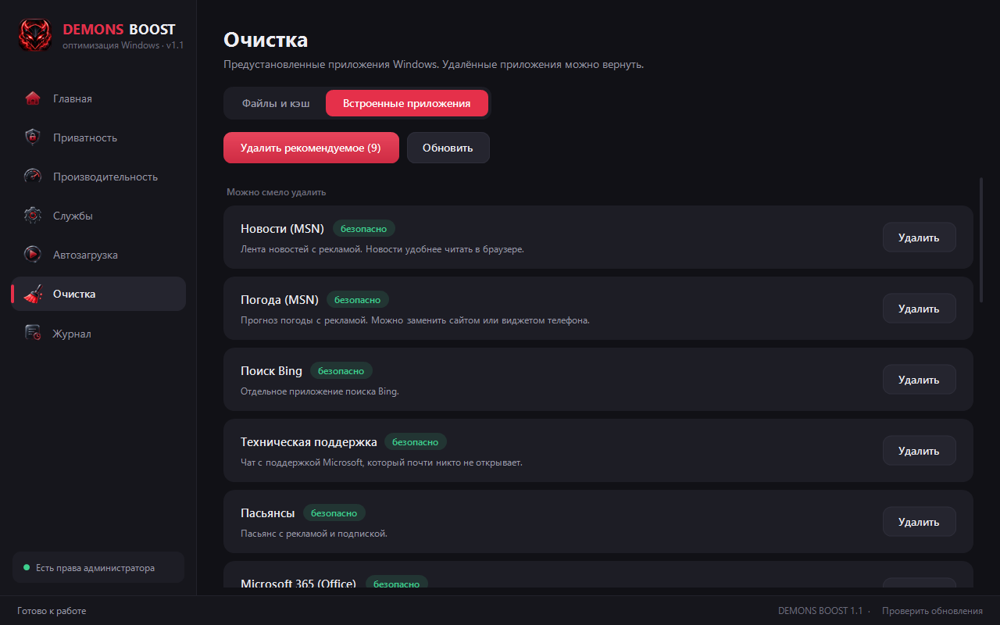
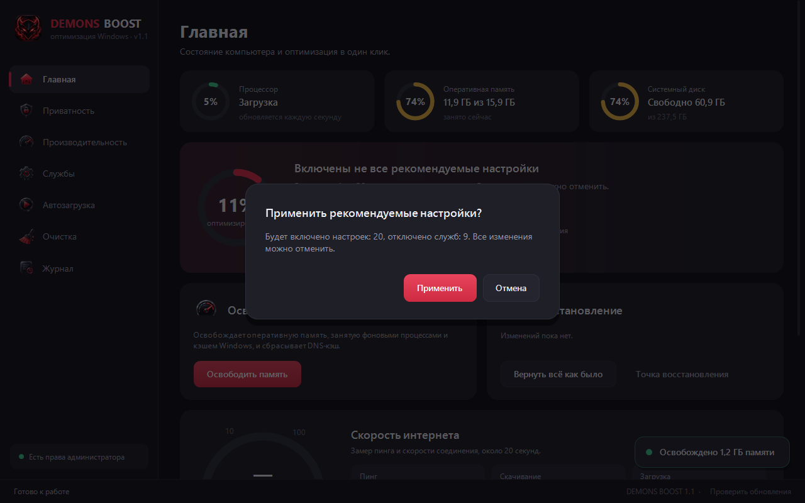

# DEMONS BOOST

Оптимизация Windows 10/11: приватность, производительность, службы, автозагрузка и очистка.
Все изменения сохраняются и отменяются одной кнопкой.

## Возможности

| Раздел | Что делает |
|---|---|
| **Главная** | Загрузка процессора, памяти и диска, процент включённых рекомендуемых настроек, применение всех рекомендуемых настроек одной кнопкой |
| **Освобождение памяти** | Очищает оперативную память от фоновых процессов и кэша Windows, сбрасывает DNS-кэш |
| **Тест скорости** | Пинг, скорость скачивания и загрузки |
| **Приватность** | 17 настроек: телеметрия, реклама, рекламный ID, Copilot и Recall, Bing в Пуске, Cortana, телеметрия Edge и другие |
| **Производительность** | 19 настроек: схема питания, приоритет активному окну и играм, Game DVR, задержка сети, залипание клавиш, ускорение мыши, планирование GPU и другие |
| **Службы** | 24 службы, которые обычно не нужны на домашнем ПК |
| **Автозагрузка** | Включение и отключение программ, запускающихся вместе с Windows |
| **Очистка** | Временные файлы, кэш обновлений, отчёты об ошибках, кэш браузеров и видеокарты, корзина |
| **Встроенные приложения** | Удаление предустановленных приложений (Candy Crush, MSN, Clipchamp, Cortana и др.) с возможностью вернуть |
| **Инструменты** | Сброс DNS, проверка системных файлов, перезапуск проводника, восстановление системы |
| **Обновления** | Программа сама проверяет новые версии и предлагает установить их |

## Скриншоты

 
 

## Использование

1. [Скачай DEMONS-BOOST.exe](https://github.com/fasahka-hd/demons-boost/releases/latest/download/DEMONS-BOOST.exe). Установка не требуется.
2. Запусти программу и подтверди права администратора.
3. Нажми «Ускорить ПК» на главной или включи нужные настройки в разделах.
4. Перезагрузи компьютер, чтобы применились все изменения.

Каждая настройка — переключатель: включение применяет её, выключение возвращает исходное значение.
Настройки отмечены как «безопасно» или «с осторожностью», у каждой есть описание.

## Безопасность

- Перед первым изменением программа предлагает создать точку восстановления Windows.
- Исходные значения всех изменённых параметров сохраняются. Кнопка «Вернуть всё как было» отменяет все изменения.
- Программы, драйверы и личные файлы не удаляются. Очистка затрагивает только временные файлы и кэш.
- Все действия записываются в журнал.

## Вопросы

<b>Windows пишет «Система Windows защитила ваш компьютер»</b>

Так SmartScreen реагирует на программы без цифровой подписи. Нажми «Подробнее» → «Выполнить в любом случае».

<b>Антивирус предупреждает о программе</b>

DEMONS BOOST меняет системные настройки, поэтому некоторые антивирусы считают это подозрительным.
Файл можно проверить на [VirusTotal](https://www.virustotal.com).

<b>Как отменить изменения?</b>

На главной нажми «Вернуть всё как было» или выключи нужный переключатель.
Также можно использовать «Восстановление системы».

<b>Как обновиться?</b>

При запуске программа проверяет обновления и предлагает установить новую версию.
Проверить вручную можно ссылкой «Проверить обновления» внизу окна.

## Требования

- Windows 10 или Windows 11 (64-bit)
- Права администратора

## История версий

Список изменений в каждой версии — на странице [Releases](https://github.com/fasahka-hd/demons-boost/releases).
